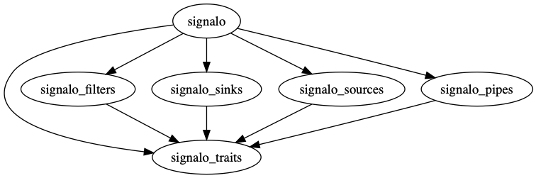

# signalo

## Synopsis

A DSP toolbox with focus on embedded environments.

Signalo provides the **basic building-blocks** for **low-level real-time filtering pipelines**,  
based on zero-cost, zero-allocation abstractions, which can be **assembled via composition**.

## About

Signalo basically consists of four basic [traits](traits) and implementations thereof:

- [`Source<T>`](sources): `() -> T`
- [`Filter<T>`](filters): `T -> U`
- [`Sink<T>`](sinks): `T -> ()`
- `Finalize`: `() -> U`

Roughly signalo's traits are equivalent in semantics to the following stdlib APIs:

- `Source<…>` ≈ `core::iter::Iterator<…>`
- `Filter<…>` ≈ `core::iter::Map<…>`
- `Sink<…>` & `Finalize` ≈ `Iterator::fold(…)`
- `Filter<…>` & `Finalize` ≈ `core::iter::Scan<…>`

Types implementing `Finalize` usually also implement either `Filter<T>` or `Sink<T>`.

Signalo provides the **basic building-blocks** for **low-level real-time filtering pipelines**,  
which can be **assembled via composition** either manually or through the use of [pipes](pipes).

## Workspace

## Versioning

We use [SemVer](http://semver.org/) for versioning. For the versions available, see the [tags on this repository](https://github.com/signalo/signalo/tags).

## License

This project is licensed under the [**MPL-2.0**](https://www.tldrlegal.com/l/mpl-2.0) – see the [LICENSE.md](LICENSE.md) file for details.

## Contributing

Please read [CONTRIBUTING.md](../CONTRIBUTING.md) for details on our [code of conduct](https://www.rust-lang.org/conduct.html), and the process for submitting pull requests to us.

Unless you explicitly state otherwise, any contribution intentionally submitted for inclusion in the work by you to the licensor shall be under the terms and conditions of this license, without any additional terms or conditions. Notwithstanding the above, nothing herein shall supersede or modify the terms of any separate license agreement you may have executed with licensor regarding such contributions.
